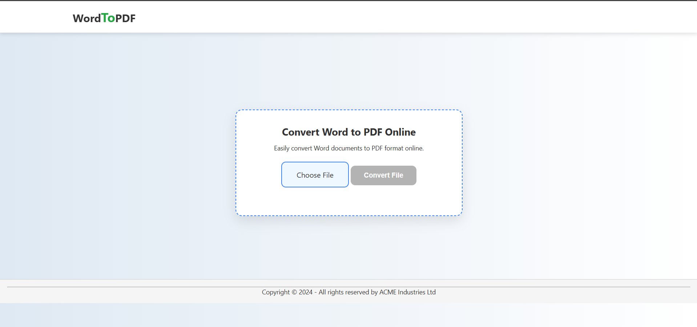

# 🔄 Convertor App

A simple and responsive Convertor App built using **HTML**, **CSS**, and **JavaScript**, deployed on **Vercel**.

🔗 **Live Demo:** [Click Here](https://convertot-app-git-main-hemant2871s-projects.vercel.app)

## ✨ Features

- ✅ Real-time value conversion
- ✅ Clean and intuitive UI
- ✅ Responsive design for all devices
- ✅ Lightweight and fast

## 🛠️ Tech Stack

- **Frontend:** HTML, CSS, JavaScript
- **Deployment:** Vercel

## 📁 Folder Structure

### convertor-app/
├── index.html
├── style.css
├── script.js
├── README.md
└── wt.png


## 🚀 How to Run Locally

1. Clone the repository:
   ```bash
   git clone https://github.com/hemant2871/convertor-app.git
   cd convertor-app

2. Open index.html in your browser.

## 📸 Screenshots

### 🖥️ Desktop View



##📬 Contact
Feel free to connect with me:

### 🔗 GitHub: 
 [Hemant](https://github.com/hemant2871)

### 💼 LinkedIn: 
 [Hemant](http://www.linkedin.com/in/hemant-sharma-3135b4290)


